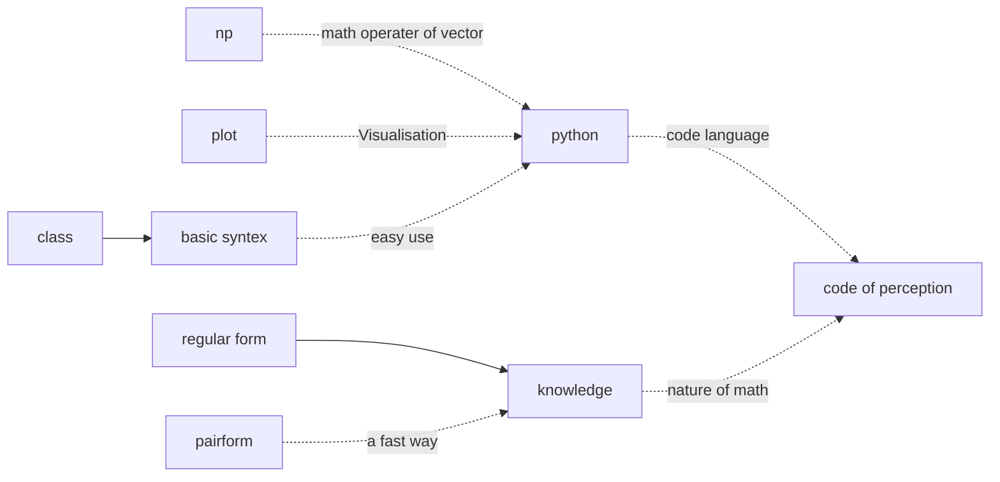

# DM
> created in 2021年4月29日 
> used for storing the codes and materials used in the Date Mining class

## log of the repository
| activity                                                     | time          |
| ------------------------------------------------------------ | ------------- |
| perception code written by myself without using other popular packages like np, so I have to write the dot multiply by myself which  definitely increases the developing time | 2021年4月30日 |
| **TODO**: TO model others code style to clarify my code and handle the way of visualization and np which contains basic math operation | 2021年4月30日 |
|**TODO** Perception.ipynb :change the order of scaning samples to be the same with the book |2021年5月6日|
|Dual_perception finished :*follow the math fomula ,make sure every single char is right (experience which consme 2 more hour)*| 2021年5月7日|

## knowledge map 

> only visible on [typora](https://mermaid-js.github.io/mermaid/#/README)

1. perception

