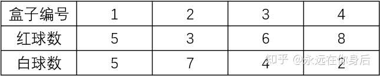
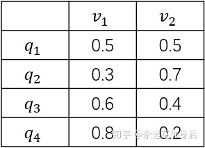
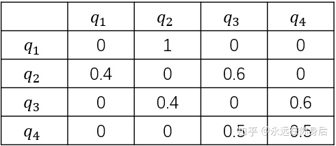

# Hidden Markov model
## 简介（定义）
Hidden Markov Model (HMM) is a statistical Markov model in which the system being modeled is assumed to be a Markov process – call it $X$ – with unobservable ("hidden") states. HMM assumes that there is another process $Y$ whose behavior "depends" on $X$. The goal is to learn about $X$ by observing $Y$. HMM stipulates that, for each time instance $n_{0}$, the conditional probability distribution of $Y_{n_{0}}$ given the history $\{X_{n}=x_{n}\}_{n\leq n_{0}}$ must not depend on $\{x_{n}\}_{n<n_{0}}$

Hidden Markov models are known for their applications to thermodynamics, statistical mechanics, physics, chemistry, economics, finance, signal processing, information theory, pattern recognition - such as speech, handwriting, gesture recognition,[1] part-of-speech tagging, musical score following,[2] partial discharges[3] and bioinformatics.[4][5]
### 组成 （定义）
* 初始概率分布
* 状态转移概率矩阵
$$A=[a_{ij}]_{N*N}$$
$$
a_ij=P(i_{t+1}=q_j\mid i_t=q_i)$$
* 观测概率分布矩阵
$$
B=[b_j(k)]_{N*N}$$
$$
b_j(k)=P(o_t=v_K|i_t=q_j)$$
* 初始分布$\pi$
$$
$$
状态集合
* 状态序列（state sequence）
$$
I =\{ i_1,i_2,\dots,i_T\}$$
>the leangth is T
* 观测序列(observation)
$$
O=\{o_1,o_2,\dots,o_T\}$$

* 三元符号表示：
$$
\lambda=(\pi,A,B)$$ 

### 两个基本的假设。（定义）
齐次马尔可夫性假设，假设隐藏的马尔科夫链在任意时刻t的状态只依赖于前一时刻的状态，与其他时刻的状态及观测无关,也和时刻t无关。
$$\operatorname {\mathbf {P} } {\bigl (}Y_{n}\in A\ {\bigl |}\ X_{1}=x_{1},\ldots ,X_{n}=x_{n}{\bigr )}=\operatorname {\mathbf {P} } {\bigl (}Y_{n}\in A\ {\bigl |}\ X_{n}=x_{n}{\bigr )},$$

观测独立性假设 ，假设任意时刻的观测只以该时刻马尔科夫链的状态，与其他观测以及状态无关。

### 例子(盒子和球模型)
图片来自[知乎](https://zhuanlan.zhihu.com/p/85454896)
盒子和球模型

假设有4个盒子，每个盒子里面有不同数量的红、白两种颜色的球，具体如下表

* 观测概率矩阵B

  

抽球的规则是：(生成观测序列)：
1. 开始，从四个盒子等概率选择色一个盒子。从其中随机抽出一个，记录颜色，然后放回
$$
\pi=(0.25,0.25,0.25,0.25)$$
2. 转移：如果当前的盒子是1，那么下一个必定是2,如果盒子是2或者3，那么分别以0.4，0.6的概率转移导左边或者右边的盒子。如果当前的盒子是3, 9.5 的概率停留或者去右边的盒子

* 状态转移矩阵为

3. 确定一个盒子，取球，记录，放回
4. 重复五次，得到一个球的颜色的观测序列$O=red,R,White,W,R$
   

### 观测序列的生成的过程。
根据马尔可夫模型的
teacher wi

### 三个基本的问题
1. 概率的计算问题
  给定$\lambda=(A,B,\pi)$和观测序列$$
  > 通过联合分布求解边缘分布。通过求和或者积分。
2.学习问题。
已知观测序列
估计 参数
3.预测问题
已知参数和观测序列
求最大的观测序列。I

## 概率计算方法
### 前向算法

前向概率：给定马尔可夫模型$\lambda$,定义导时刻t部分观测序列为$o_1,\dots,o_t$,且状态为$q_i$的概率为a

>边缘分布，转化为联合分布（增加一个var)>

> 如何计算$\alpha_{T}(i)$
>$$
\alpha_{T}(i)=P(O,i_T\mid \lambda)$$
> 增加一个变量$i_{T-1}$
$$
 =\sum_{j=1}^{N}=P(O,i_T\mid ,i_{T-1}\lambda)$$
 