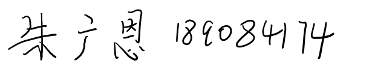
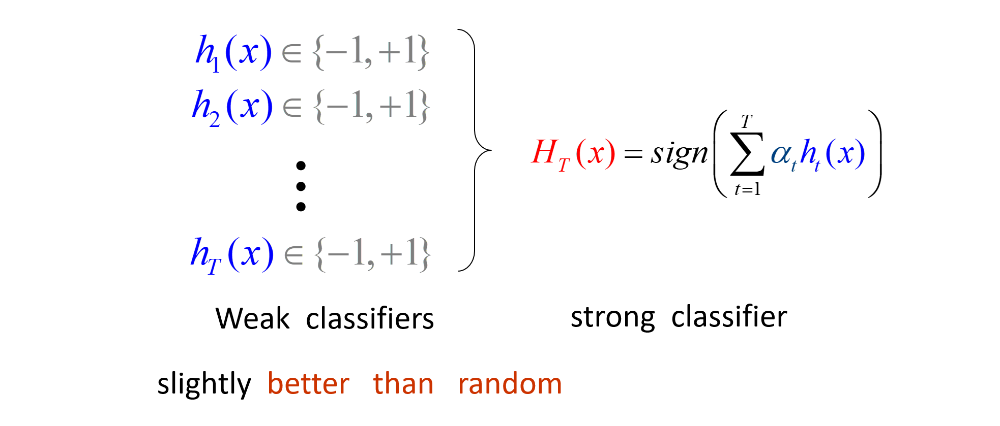

# 提升方法Adaboost

## 简介
### 强可学习(strongly learnable)和弱可学习(weakly learnable)
* **强可学习的**:
在概率近似正确（probably approximately correct, PAC)学习的框架中，一个概念（类），如果存在一个多项式的学习算法能够学习它，并且正确率很高

* **弱可学习的**:
一个概念（类），如果存在一个多项式的学习算法能够学习它，学习的正确率仅比随机猜测略好，则称这个概念是

**一个概念是强可学习的充分必要条件是这个概念是弱可学习**
>只要找到一个比随机猜测略好的弱学习算法就可以直接将其提升为强学习算法，而不必直接去找很难获得的强学习算法

* Building a strong classifier a lot of weaker ones
  * ada:Adaptive
  * ABoost:boosting

### 两个问题
*每一轮如何改变训练数据的权值或概率分布？*

AdaBoost：**提高那**些被前一轮弱分类器错误分类样本的权值，**降低**那些被正确分类样本的权值

*如何将弱分类器组合成一个强分类器？*

AdaBoost：**加权多数表决，**加大分类误差率小的弱分类器的权值，使其在表决中起较大的作用，减小分类误差率大的弱分类器的权值，使其在表决中起较小的作用

## AdaBoost算法
AdaBoost算法

1. 初始化训练数据的权值分布
$D_{1}=\left(w_{11},w_{12},\cdots,w_{1N}\right), \quad w_{1i} = \dfrac{1}{N}, \quad i=1,2,\cdots,N$

2. 对$m=1,2,\dots,M$

a.  使用具有权值分布 $D_M$的训练数据集学习，得到基本分类器
$$
G_{m}\left(x\right): \mathcal{X} \to \left\{ -1, +1\right\} $$

b计算$G_m(x)$ 在训练数据集上的分类误差率

$$
e_{m} = \sum_{i=1}^{N} P\left(G_{m}\left(x_{i}\right) \neq y_{i}\right) = \sum_{i=1}^{N} w_{mi} I \left(G_{m}\left(x_{i}\right) \neq y_{i} \right) $$

c.计算 $G_m(x)$  的系数
$$
 \alpha_{m} = \dfrac{1}{2} \log \dfrac{1-e_{m}}{e_{m}} 
$$

d. 更新训练数据集的权值分布
$$
D_{m+1}=\left(w_{m+1,1},\cdots,w_{m+1,i},\cdots,w_{m+1,N}\right) w_{m+1,i} = \dfrac{w_{mi}}{Z_{m}} \exp \left(- \alpha_{m} y_{i} G_{m}\left(x_{i}\right)\right),\quad i=1,2,\cdots,N$$
  >Z_m是规范化因子

$$Z_{m}＝ \sum_{i=1}^{N} w_{mi} \exp \left(- \alpha_{m} y_{i}, G_{m}\left(x_{i}\right)\right)$$

3. 构建基本分类器的线性组合
$$
f \left( x \right) = \sum_{m=1}^{M} \alpha_{m} G_{m} \left( x \right) 
$$
得到最终分类器

$$
G\left(x\right) = sign\left(f\left(x\right)\right)=sign\left(\sum_{m=1}^{M} \alpha_{m} G_{m} \left( x \right)\right)$$

### 算法的说明：
1.计算$G_m(x)$  在训练数据集上的分类误差率
$$
e_{m} = \sum_{i=1}^{N} P\left(G_{m}\left(x_{i}\right) \neq y_{i}\right)=\sum_{i=1}^{N} w_{mi} I \left(G_{m}\left(x_{i}\right) \neq y_{i}\right)=\sum_{G_{m}(x_{i})\neq y_{i}} w_{mi}
$$

这里$\sum_{i=1}^{N} w_{mi}=1$ ，这表明 $G_m(x)$  在加权的训练数据集上的分类错误率是被 $G_m(x)$  误分类样本的权值之和，由此可以看出数据全值分布 $D_m$与基本分类器 $G_m(x)$  的分类误差率的关系。

2.当 $e_{m}\leqslant 1/2$ 时， $a>=0$ ，并且$a$随着 $e_m$ 的减少而增大，所以误分类误差率越小的基本分类器在最终分类器的作用越大。

3.更新训练数据的权值分布为下一轮做准备，式可以写成：

$$
w_{m+1,i}=\left\{\begin{matrix} \frac {w_{mi}}{Z_{m}}e^{-\alpha_{m}},~~~G_{m}(x_{i})= y_{i}\\ \frac {w_{mi}}{Z_{m}}e^{\alpha_{m}},~~~~G_{m}(x_{i})\neq y_{i} \end{matrix}\right.\\
$$

由此可知，被基本分类器 $G_m(x)$ 误分类样本的权值得以扩大，而被正确分类的样本的权值得以缩小。

4.这里系数 $a_m$  表示了基本分类器$G_m(x)$  的重要性，所以$a_m$ 之和并不为1。 $f(z)$的符号决定实例 $x$ 类， $f(z)$的绝对值表示分类的确信度。

##  Adaboost算法的训练误差分析

(**Adaboost的训练误差界**) Adaboost算法最终分类器的训练误差界为
$$
\frac {1}{N}\sum_{i=1}^{N}I(G(x_{i})\neq y_{i})\leqslant \frac{1}{N}\sum_{i}exp(-y_{i}f(x_{i}))=\prod _{m}Z_{m}$$

这里一定理说明可以在每一轮选取适当的$G_M$ 使得 $Z_m$ 最小，从而使得误差下降的最快。

### (二分类问题Adaboost的训练误差界)
$$
\prod _{m=1}^{M}Z_{M}=\prod _{m=1}^{M}[2\sqrt {e_{m}(1-e_{m})}]=\prod _{m=1}^{M}\sqrt{(1-4\gamma _{m}^{2})}\leqslant exp(-2\sum_{m=1}^{M}\gamma _{m}^{2})$$

这里，$\gamma _{m}=\frac {1}{2}-e_{m}$

## AdaBoost算法的解释

AdaBoost算法是前向分布加法算法的特例。这时模型是由基本分类器组成的加法模型，损失函数是指数函数。

### 前向分布算法

加法模型 additive model
$$
 f \left( x \right) = \sum_{m=1}^{M} \beta_{m} b\left(x;\gamma_{m}\right) $$

 > $b\left(x;\gamma_{m}\right)$是基函数

 在给定训练数据及损失函数$L\left(y,f\left(x\right)\right)$的条件下，学习加法模型 f（x)成为经验风险极小化问题

 $$
 \min_{\beta_{m},\gamma_{m}} \sum_{i=1}^{N} L \left( y_{i}, \sum_{m=1}^{M} \beta_{m} b\left(x_{i};\gamma_{m}\right) \right) 
 $$

 习加法模型，从前向后每一步只学习一个基函数及其系数，即每步只优化
 $$
  \min_{\beta,\gamma} \sum_{i=1}^{N} L \left( y_{i}, \beta b\left(x_{i};\gamma\right) \right) 
 $$

 