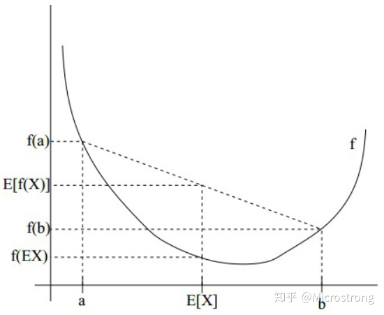

>author:平平无奇一个对这个世界很好奇的小白罢了：CodeOnce

>time:2021年5月10日

学习资料：本次学习中的参考资料

1. 知乎：[EM算法详解](https://zhuanlan.zhihu.com/p/40991784)
2. wikipedia:[Maximum likelihood estimation](https://en.wikipedia.org/wiki/Maximum_likelihood_estimation)
3. 《统计学习方法》李航 第二版

## 1.摘要
>wiki:最大期望算法（Expectation-maximization algorithm，又译期望最大化算法）在统计中被用于寻找，依赖于不可观察的隐性变量的概率模型中，参数的最大似然估计。
>
>在统计计算中，最大期望（EM）算法是在概率模型中寻找参数最大似然估计或者最大后验估计的算法，其中概率模型依赖于无法观测的隐变量。最大期望算法经常用在机器学习和计算机视觉的数据聚类（Data Clustering）领域。最大期望算法经过两个步骤交替进行计算，第一步是计算期望（E），利用对隐藏变量的现有估计值，计算其最大似然估计值；第二步是最大化（M），最大化在E步上求得的最大似然值来计算参数的值。M步上找到的参数估计值被用于下一个E步计算中，这个过程不断交替进行。

* EM算法通迭代求数似然函数 $L(\theta)=log(P(Y|\theta))$的极大似然估计。每次迭代包含两步，E步：求期望。M步：求极大化。
* EM 算法是 十大算法之一，很重要
* 需要用大极大似然估计（MLE）的思想，需要先了解一些基本的例子。

## 预备知识
### 概率 
* 使用很多概率的内容。多元条件概率的形式要把握清楚。比如这个样子
${\mathcal{L}}(\mu,\sigma)=f(x_1,\dots,x_n \mid \mu ,\sigma)$
以及多元函数条件概率的相关公式:
$f_{X_1, \ldots, X_n}(x_1, \ldots, x_n) = f_{X_n | X_1, \ldots, X_{n-1}}( x_n | x_1, \ldots, x_{n-1}) f_{X_1, \ldots, X_{n-1}}( x_1, \ldots, x_{n-1} ) .$

### MLE 算法

example1:
>me:(MLE 的思想是想方法在参数空间内找到一个最适合的参数，使得 样本点$P(x_1,x_2,\dots|\theta_1,\theta_2,\dots)$ 出现的概率最大)
>
>(一般见到的习题上的方法(比如下面的例子)是可以构造一个方便求极值的函数，这样就可以通过直接 求 稳定点来获得极值)

>（但是，显然我们知道这种方法很有局限性，如果参数空间是离散的，有限的，其实用枚举的方法也可以是一种好方法）
>
>(再或者，我们构造的函数无法方便的求得极值，我们可能需要采取一些数值方法，比如本章中EM的例子。使用迭代的方法来求解)
>总的来说，MLE是一种思想，不要局限于一种特定的问题，和特定的解法上。

For the normal distribution ${\mathcal {N}}(\mu ,\sigma ^{2})$ which has probability density function

$$f(x\mid \mu ,\sigma ^{2})={\frac {1}{{\sqrt {2\pi \sigma ^{2}}}\ }}\exp \left(-{\frac {(x-\mu )^{2}}{2\sigma ^{2}}}\right),$$

the corresponding probability density function for a sample of n independent identically distributed normal random variables (the likelihood) is

$$f(x_{1},\ldots ,x_{n}\mid \mu ,\sigma ^{2})=\prod _{i=1}^{n}f(x_{i}\mid \mu ,\sigma ^{2})=\left({\frac {1}{2\pi \sigma ^{2}}}\right)^{n/2}\exp \left(-{\frac {\sum _{i=1}^{n}(x_{i}-\mu )^{2}}{2\sigma ^{2}}}\right).$$
This family of distributions has two parameters: θ = (μ, σ); so we maximize the likelihood, ${\mathcal {L}}(\mu ,\sigma )=f(x_{1},\ldots ,x_{n}\mid \mu ,\sigma )$, over both parameters simultaneously, or if possible, individually.

Since the logarithm function itself is a continuous strictly increasing function over the range of the likelihood, the values which maximize the likelihood will also maximize its logarithm (the log-likelihood itself is not necessarily strictly increasing). The log-likelihood can be written as follows:

$$\log {\Bigl (}{\mathcal {L}}(\mu ,\sigma ){\Bigr )}=-{\frac {\,n\,}{2}}\log(2\pi \sigma ^{2})-{\frac {1}{2\sigma ^{2}}}\sum _{i=1}^{n}(\,x_{i}-\mu \,)^{2}$$
(Note: the log-likelihood is closely related to information entropy and Fisher information.)

We now compute the derivatives of this log-likelihood as follows.

$${\begin{aligned}0&={\frac {\partial }{\partial \mu }}\log {\Bigl (}{\mathcal {L}}(\mu ,\sigma ){\Bigr )}=0-{\frac {\;-2\!n({\bar {x}}-\mu )\;}{2\sigma ^{2}}}.\end{aligned}}$$
where ${\bar {x}}$ is the sample mean. This is solved by

${\widehat {\mu }}={\bar {x}}=\sum _{i=1}^{n}{\frac {\,x_{i}\,}{n}}.$\,x_{i}\,}{n}}.}

### Jensen不等式
设f是定义域为实数的函数，如果对所有的实数x，f(x)的二阶导数都大于0，那么f是凸函数。

Jensen不等式定义如下：

如果f是凸函数，X是随机变量，那么： $E[f(x)]>=f(E[x])$ 。当且仅当X是常量时，该式取等号。其中，E(X)表示X的数学期望。

## EM算法

### 基本的概念和名词

* 观测变量(observable variable)：
  * eg
    * :今天是否下雨
    * 下面例子中的随机变量Y
* 隐变量，潜在变量 (latent vairable)
  * eg：
    * 今天的云是什么样子（没有观察）。
    * 下面随机变量Z
* 完全数据（complete-data):Y和Z
* 不完全数据（incomplete-data）:Y
* 似然函数：$P(Y|\theta)$ 假设参数$\theta$已知时候，Y出现的概率 
* 对数似然函数：$log(P|\theta)$
* Y,Z的联合概率分布$P(Y,Z|\theta)$
* 完全数据的对数似然函数$log(P(Y,Z\mid \theta))$
* 
### 三硬币模型

#### 问题描述
有3个硬币，分别记作A,B,C。这些硬币的正面出现的概率分别是$\pi,p,q$。进行如下的抛硬币实验：先抛掷硬币A,如果结果为正面，抛掷硬币B,正面记作1,反面记作0；如果A硬币的结果为反面，抛掷硬币C.
重复进行n次实验。观测的结果如下 （这里，n=10）
$$
1,1,0,1,0,0,1,0,1,1(正面 6次,反面4次)
$$
假设只能够观测抛掷硬币的结果，不能观测的过程（就是不知道究竟是哪枚硬币的结果)。问：如何估计三硬币正面出现的概率（就是三硬币模型的参数）

#### 解决方法

记

随机变量$y$是观测变量，表示一次抛硬币的结果（1 or 0)

随机变量$z$是硬币A的抛掷结果，（**隐变量）**

三硬币模型可以写作
$$
P(y\mid \theta)=\sum_{z} P(y,z\mid \theta)  
\qquad 式子中增加隐变量 z
$$
> 式子是多元密度函数函数求边际密度函数的方法。
$$
=\sum_{z}P(y\mid z,\theta)P(z \mid \theta) \qquad 条件概率展开。注意是多元的，写法可能比较陌生
$$
>$备注：忽略\theta ,上面转化为一元的，写为 P(y,z)=P(y|z)P(z)$
$$
=\pi p^y(1-p)^{1-y} +(1-\pi)q^y(1-q)^{1-y} ,p,q是
$$
>$备注：0-1分布，两点分布的 表达式为 P(X=x)=p^x(1-p)^{1-x},x=1或者0,p可以理解为硬币正面的概率。$

将观测数据表示为$Y=(Y_1,Y_2,\dots,Y_n)$,未观测数据表示未$Z=(Z_1,Z_2,\dots,Z_n)$
则观测数据的似然函数为
$$
P(Y\mid \theta)=\sum_{Z}P(Z\mid \theta)P(Y\mid Z,\theta)$$
即
$$
P(Y\mid \theta)=(\pi)p^Y(1-p)^{1-Y}+(1-\pi) q^Y(1-q)^{1-Y}$$
>Z=0,1 $\sum_{Z}P(Z\mid \theta)P(Y\mid Z,\theta)=\sum_{Z=1,or 0}~=P(Z=1\mid \theta)P(Y\mid Z=1,\theta)+P(Z=0)\dots$
$$
P(Y\mid \theta)=\prod_{j=1}^{n}\pi p^{y_j}(1-p)^{y_j}+(1-\pi) q^{y_j}(1-q)^{1-y_j}$$

> $P(Y)=P(y_1,y_2,\dots,y_n)=P(y_1)P(Y_2)\dots P(y_n)$

考虑求模型的参数$\theta=(\pi,p,q)$的极大似然估计，即
$$
\hat{\theta}=arg max_{\theta}log P(Y\mid \theta)$$
这个问题没有解析解，只有通过迭代的方法求解。EM算法就是可以用于求解这个问题的一种迭代算法。下面给出针对以上问题的EM算法，其推导过程省略

#### EM算法
首先选择参数的初值,记作$\theta^{(0)}=(\pi^{(0)}+p^{(0)}+q^{(0)})$

然后通过下面的迭代 计算 参数的**估计值**，直到收敛为止

> 这里的收敛可以理解为积分里面的收敛。一般的收敛可能就是指随着自变量的单调变化，函数值不会发生变化，一般都是达到了我们想要的最优值

表示:第 i次迭代参数的估计值为$\theta^{(i)}=(\pi^{(i)}+p^{(i)}+q^{(i)})$

EM算法的第**i+1 次**的迭代如下：

E步：计算在模型参数 $\theta^{(i)}=(\pi^{(i)}+p^{(i)}+q^{(i)})$下观测数据$y_j$ 来自抛掷硬币B的概率

$$
\mu_{j}^{(i+1)}=\frac{\pi p^{y_j}(1-p)^{1-y_j}}{\pi p^{y_j}(1-p)^{1-y_j}+(1-\pi) q^{y_j}(1-q)^{1-y_j}}$$

>分母是$P(Y=y^i|\theta)=\sum_{Z}P(Y=y^i,Z\mid \theta)$,分子是$P(Y=y^i,Z=1,\theta)$

>注意这里是第j个样本点的结果

M步：
计算模型参数的新估计值
$$
\pi^{(i+1)}=\frac{1}{n}\mu_j^{(i+1)}$$
>所有样本点的平均

<!-- 09点52分 -->
$$
p^{(i+1)}=\frac{\sum_{j=1}^n\mu_j^{i+1}y_j}{\sum_{j=1}^{n}\mu_j^{(i+1)}}$$
>y_j=0 如果不是正面。所以分子是硬币B 为正面的概率，分母是硬币为B的概率

$$
q^{(i+1)}=\frac{\sum_{j=1}^n(1-\mu_j^{i+1})y_j}{\sum_{j=1}^{n}1-\mu_j^{(i+1)}}$$
>$1-\mu_j^{i+1}$是掷硬币为B的概率

#### 数值计算
假设模型参数的取值为
$\theta^{(0)}=(\pi^{(0)}+p^{(0)}+q^{(0)})=(0.5,0.5,0.5)$
$$
\mu_j^{(1)}=0.5,y_j=0或者1$$
迭代得到
$$
\theta^{(1)}=(\pi^{(1)}+p^{(1)}+q^{(1)})=(0.5,0.6,0.6)$$
再得
$$
\mu_j^{(2)}=0.5$$
迭代
$$
\theta^{(2)}=(\pi^{(2)}+p^{(2)}+q^{(2)})=(0.5,0.6,0.6)$$

> 和上一次迭代结果相同，结果收敛，迭代结束

于是得到模型参数$\theta$的极大似然估计
$$
\hat{\theta}=(\hat{\pi}+\hat{p}+\hat{q})=(0.5,0.6,0.6)$$

注意:如果初值改变，得到的结果也是不同的。
### EM算法
输入：**观测变量**数据Y,**隐变量**数据Z,联合分布$P(Y,Z\mid \theta)$，条件分布$P(Y\mid Z,\theta)$

输出：模型参数$\theta$

(1)选择参数的初值$\theta^{(0)}$，开始迭代

(2)E步：记$\theta^{(0)}$为第i次迭代参数$\theta$的估计值，在第$i+1$次迭代的E步，计算
$$
Q(\theta\ ,\theta^{i})=Ez[logP(Y,Z\mid \theta)\mid Y ,\theta^{(i)})]$$
>Q 函数(Q function) is the key point of EM
$$
=\sum_{Z}log P(Y,Z\mid \theta)P(Z\mid Y,\theta^{(i)})$$
> $P(Z\mid Y,\theta)^{(i)}$表示的是在$\theta^{(i)}$和$Y$给定情况下$Z$的概率

(3)M步：
求使$Q(\theta,\theta^{(i)})$极大化的$\theta$ 确定第i+1次迭代的参数的估计值
$$\theta^{(i+1)}=arg\max_{\theta}Q(\theta,\theta^{(i)})$$

(4)重复第(2)步和第(3)步，直到收敛

### Q 函数
 完全数据的对数似然函数$\log P(Y,Z\mid \theta)关于在给定观测数据Y 和当前参数 \theta^{(i)}$下对未观测数据Z的条件概率分布$P(Z\mid Y,\theta)$的期望称为$\theta$函数，即
$$
Q(\theta\ ,\theta^{i})=Ez[logP(Y,Z\mid \theta)\mid Y ,\theta^{(i)})]$$
下面关于EM算法作几点说明：

步骤(1)参数的初值可以任意选择，但需要注意EM算法对初值是敏感的

步骤(2) E步求$Q(\theta,\theta^{(i)})$。Q函数中Z是未观测数据，Y是观测数据，$Q(\theta,\theta^{(i)})$ 的第一个参数表示要极大化的参数，第二个变元表示参数的当前值，每次迭代实际在求

步骤(3) M步求$Q(\theta,\theta^{(i)})$ 的极大化，得到$\theta^{(i)})$,完成一次迭代$\theta^{(i)}\Rrightarrow \theta^{(i+1)}$

步骤(3) 迭代步骤停止的条件：一般是 对较小的正数，若满足
$$
\theta^{(i)}- \theta^{(i+1)}  <\delta_1$$
$$
Q(\theta^{(i+1)} ,\theta^{i})-Q(\theta^{(i)} ,\theta^{i-1})<\delta_2$$

<!-- todo:EM算法的math principle -->

## EM算法的导出
为什么EM 算法嫩巩固近似实现对观测数据的极大似然估计呢？
下面通过近似求解观测数据的对数似然估计函数的极大化问题来导出EM 算法。
由此可以清楚地看出EM算法地作用 

我们面对一个含有隐变量的概率模型，目标是极大化观测数据（不完全数据）Y关于参数$\theta$ 的对数似然函数，即极大化
$$
L(\theta)=\log{P(T\mid \theta)}=\log(\sum_{Z}P(Y,Z\mid \theta))=\log{\sum_{Z}P(Y\mid Z,\theta)P(Z\mid \theta)}
$$ (1)
> 上面的式子使用的知识，分别是多元密度函数和边际密度函数的转化关系。以及，条件函数$P(AB)=P(A\mid B）P(B)$

注意到这一极大化的主要困难是式子（1）中含有 为观测数据并包含和（或者积分：多元-》边际，离散：求和，连续：积分） 的对数

事实上，EM 算法是通过迭代逐步近似极大化$L(\theta)$。假设在第i次迭代后$\theta$的估计值是$\theta^(i)$,我们希望新股机制$\theta$能使$\L(\theta)$增大，就是$L(\theta)>L(\theta^(i))$,并且逐步达到极大值。为此，考虑两者的差
$$
L(\theta)-L(\theta^{(i)})=\log{\sum_{Z}P(Y\mid Z,\theta)P(Z\mid \theta)}-\log{P(Y\mid \theta^{(i)})}$$
利用 Jensen不等式（Jensen inequality ）得到其下界。

$$
> 对 L(\theta)括号内的连加项中的每一个同时除以和乘一个P（Z\mid Y,\theta^{(i)}）
$$
$$
L(\theta)-L(\theta^{(i)})=\log{\sum_{Z}P(Y\mid Z,\theta)P(Z\mid \theta)}-\log{P(Y\mid \theta^{(i)})}$$
$$
\log{\sum_{Z}P（Z\mid Y,\theta^{(i)}）\frac{P(Y\mid Z,\theta)P(Z\mid \theta)}{P（Z\mid Y,\theta^{(i)}）}}-\log{P(Y\mid \theta^{(i)})}$$

$$
\geq \sum_{Z}P（Z\mid Y,\theta^{(i)}）\log{\frac{P(Y\mid Z,\theta)P(Z\mid \theta)}{P（Z\mid Y,\theta^{(i)}）}}-\log{P(Y\mid \theta^{(i)})}$$
> 通过 $\log{A}-\log{B}=log{\frac{A}{B}}$,以及$\sum_{Z}P(Z)=1$我们可以知道上面的式子可以转化为

$$
= \sum_{Z}P（Z\mid Y,\theta^{(i)}）\log{\frac{P(Y\mid Z,\theta)P(Z\mid \theta)}{P（Z\mid Y,\theta^{(i)}）\log{P(Y\mid \theta^{(i)})}}}
$$ 

然后我们把上面不等式 第一项中的$L(\theta^{(i)})$移动到式子的右边。记作$B(\theta,\theta^{(i)})$，显然不等式仍然成立

$$
令B(\theta,\theta^{(i)})=L(\theta^{i})+\sum_{Z}P（Z\mid Y,\theta^{(i)}）\log{\frac{P(Y\mid Z,\theta)P(Z\mid \theta)}{P（Z\mid Y,\theta^{(i)}）\log{P(Y\mid \theta^{(i)})}}}
$$ （2）
> 由于不等式仍然成立，所以可以得到

$$
L(\theta)\geq  B(\theta,\theta^{(i)})
$$

所以 函数  $B(\theta,\theta^{(i)})$是 $L(\theta)$的下界。而且通过式子 （2）可以知道，如果带入 $\theat$ = $\theta^{(i)}$
> 等式（2）右边第二项 中 $\log{\frac{P(Y\mid Z,\theta)P(Z\mid \theta)}{P（Z\mid Y,\theta^{(i)}）\log{P(Y\mid \theta^{(i)})}}}$ 中的分子分母相同，log1=0，所以被消去

$$
L(\theta^{(i)})=B(\theta^{(i)},\theta^{(i)})
$$
因此，任何可以使得 $B(\theta,\theta^{(i)})$ 增大的$\theta$ ,也可以使得 $L(\theta)$增大，为了使得 $L(\theta)$尽可能地增大，选择 $theta^{(i)}$ 使得$B(\theta,\theta^{(i)})$ 达到极大。
即
$$
\theta^{(i+1)}=\arg{\max_{\theta}B(\theta,\theta^{(i)})}
$$

现在 求$\theta^{(i)}$的表达式，省去对$\theta$极大化而言是常熟的项。
> 比如$\theta^{(i)}$

$$
\theta^{(i+1)}=\arg{\max_{\theta}B(\theta,\theta^{(i)})}
$$
$$
=
\arg{\max_{\theta}L(\theta^{i})+\sum_{Z}P（Z\mid Y,\theta^{(i)}）\log{\frac{P(Y\mid Z,\theta)P(Z\mid \theta)}{P（Z\mid Y,\theta^{(i)}）\log{P(Y\mid \theta^{(i)})}}}
}
$$
$$
=
\arg{\max_{\theta}\sum_{Z}P（Z\mid Y,\theta^{(i)}）\log{\frac{P(Y\mid Z,\theta)P(Z\mid \theta)}{1}}
}
$$
> 分母中是的P由 $\theta^{i}$绝对的大小，极大化没有影响，所以都删除

$$
=
\arg{\max_{\theta}\sum_{Z}P（Z\mid Y,\theta^{(i)}）\log{\frac{P(Y，Z\mid\theta)}{1}}
}
$$
$$
\arg{\max_{\theta}Q(\theta,\theta^{(i)})]}
$$

上面的式子等价于 EM 的一次迭代，就是求Q函数的极大化，，所以EM 算法是通过不断求下界的极大化逼近求解对数似然函数极大化的算法。

